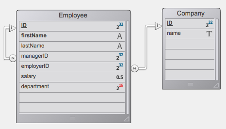

# HDI_ORDA_Query

> **How do I query my database with an object-oriented approach?** -- a 4D "How Do I" (HDI) example for ORDA queries.

| | |
|---|---|
| **Topic** | ORDA data classes, entity selections, `query()`, `orderBy()`, relation attributes |
| **Requires** | 4D 21.1 or later (project mode) |
| **Platforms** | macOS, Windows |
| **Languages** | English, Japanese (XLIFF) |
| **License** | [MIT](LICENSE) |

## Overview

An interactive tour of the ORDA query API. A splash dialog introduces the example, then a tabbed form walks through progressively richer queries against a small `Employee` / `Company` datastore. Every tab has an explanation, the live result in a list box, and a **Trace** checkbox so you can step through the code behind each button in the debugger.

## Features

| Tab | What you learn |
|-----|----------------|
| Query with placeholders | `dataClass.query("salary > :1"; value)`, `or` conditions, between-style ranges with a `parameters` collection |
| Query without placeholders | Passing a complete query string, e.g. `firstName = 'e@' and lastName = 's@'` |
| Query plan and path | `queryPlan` / `queryPath` options of `query()` and how to display them |
| Sort | `orderBy()` with a string and with a collection of `propertyPath` / `descending` objects |
| Relation attributes | Querying through `employer.name`, `manager.lastName`, `manager.manager.lastName` |
| Recursive link | Walking `manager` / `directReports` to find colleagues |
| Entity selections | Chaining `query()` on an existing selection |
| Extracting properties | Projecting an entity selection to a collection (`lastName`) or to a related entity selection (`employer`) |

## Data model



`Employee.employer` / `Company.employees` is a N-to-1 relation; `Employee.manager` / `Employee.directReports` is a recursive relation on the same table. Sample data ships as 4D export files in `Resources/` (`*.4ie` / `*.4si`) and is imported automatically on first launch when a table is empty.

## Getting started

1. Open `Project/HDI_ORDA_Query.4DProject` with 4D 21.1 or later.
2. Run the `00_Start` method (or choose **File > Demo**).
3. Pick a tab, press a button, and tick **Trace** to follow the code.

## Points of interest

- **Startup dialog.** `00_Start` runs in two roles: without parameters it imports sample data, reuses the splash window if one is already open, and otherwise delegates to the application process with `CALL WORKER`. With parameters it opens the splash through a non-blocking `DIALOG(...; *)`. No `New process`, no `CLOSE WINDOW`.
- **State lives in `Form`.** Query inputs and results are properties of the form object (`Form.employees`, `Form.salary`, ...), bound directly to list boxes and inputs; the splash `Form` is handed to the next dialog.
- **Minimum version / license gate.** The splash form checks `minimumVersion` and optional 4D View/Write license and switches to an explanatory overlay when not met.
- **Standard actions.** The Quit and Edit menu items use `"action"` in `menus.json` instead of wrapper methods.
- **Localisation.** All UI text is resolved through XLIFF (`:xliff:` in JSON, `Localized string` in code); 4D's built-in `Common*` IDs are reused for standard items.
- **Appearance.** Dark mode through `"automatic"` / `"automaticAlternate"` colors and `prefers-color-scheme` media queries; macOS Tahoe Liquid Glass button sizing through `form-theme` media queries.
- **Modern language syntax.** `var` / `#DECLARE` throughout; no `C_*` declarations.

## Project layout

```
Project/Sources/
  Methods/                00_Start (entry point), initPages, RW, Compiler_*
  Forms/HDI/              splash dialog
  Forms/HDI2/             tabbed query demo (object methods hold the ORDA queries)
  TableForms/             input/output forms for INFO, Employee, Company
  menus.json              menu bar (standard actions)
  styleSheets.css         dark / light colors (cross-platform)
  styleSheets_mac.css     fonts, Liquid Glass / classic button height
  styleSheets_windows.css fonts, Fluent UI / classic button height
Resources/
  en.lproj/  ja.lproj/    XLIFF: menu, messages, HDI, HDI2, TableForms
  Images/                 splash background, data model diagram
  *.4ie, *.4si            sample data and import structure
```

## References

- Blog: [Query your database with an object-oriented approach](https://blog.4d.com/query-your-database-with-an-object-oriented-approach/)
- Docs: [ORDA](https://developer.4d.com/docs/ORDA/overview), [`dataClass.query()`](https://developer.4d.com/docs/API/DataClassClass#query), [`entitySelection.orderBy()`](https://developer.4d.com/docs/API/EntitySelectionClass#orderby)
- Docs: [CSS in forms](https://developer.4d.com/docs/FormEditor/stylesheets), [Menu properties](https://developer.4d.com/docs/Menus/properties), [Variables and `#DECLARE`](https://developer.4d.com/docs/Concepts/variables)

## Origin

Originally the 4D v17 binary database `HDI_ORDA_Query` ([download](https://download.4d.com/Demos/4D_v17/HDI_ORDA_Query.zip)), converted to project mode with 4D 21 and modernised.

## License

[MIT](LICENSE)
